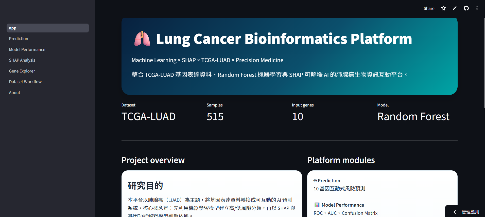
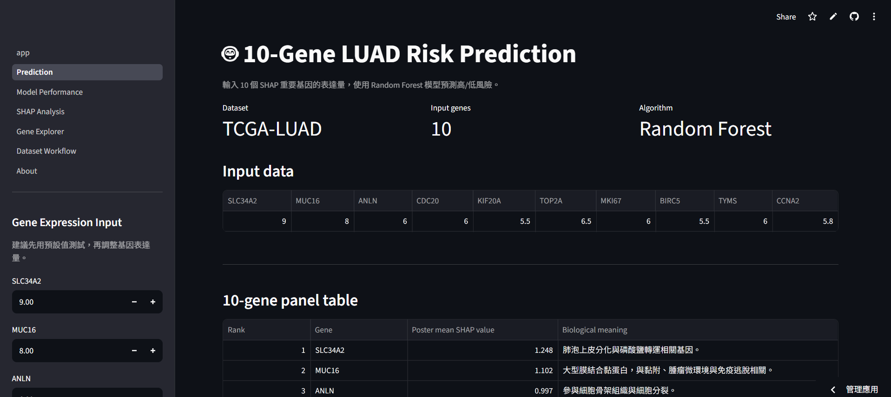
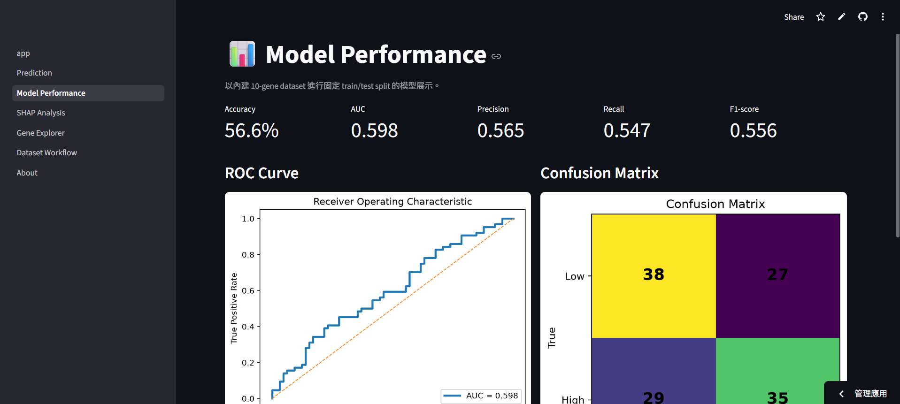
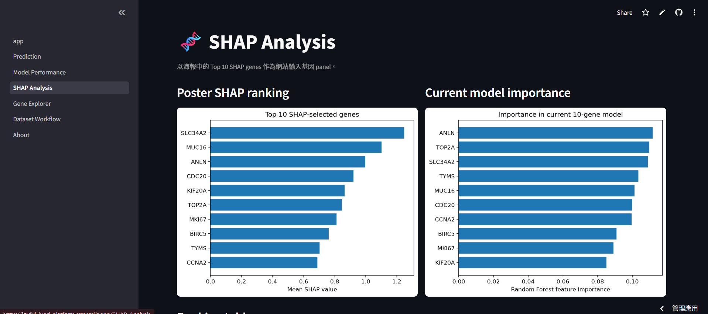
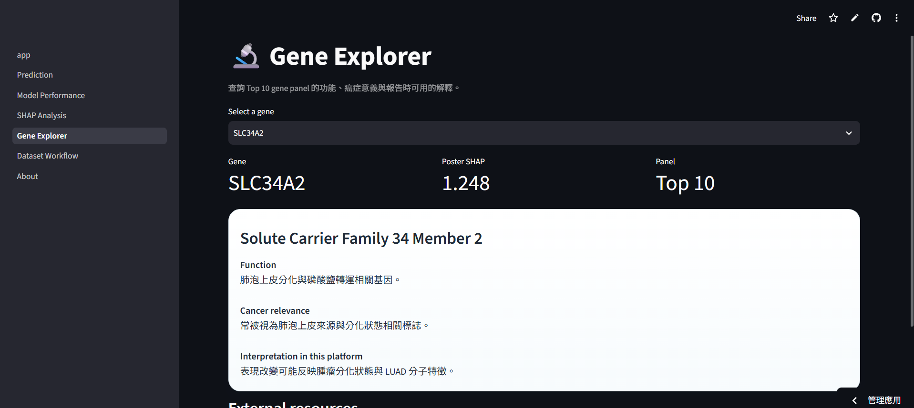
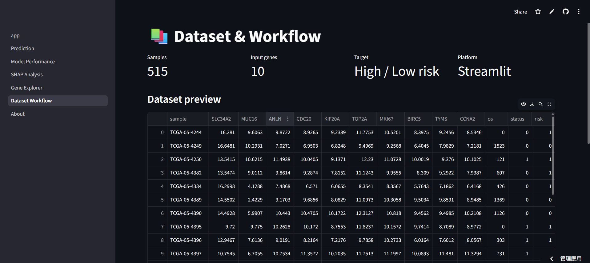
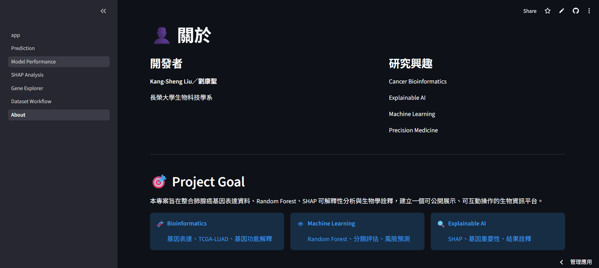

# 🫁 Lung Cancer Bioinformatics Platform



> **Machine Learning × SHAP × TCGA-LUAD × Precision Medicine**

An interactive bioinformatics platform for **Lung Adenocarcinoma (LUAD) prediction** using **Random Forest** and **10 SHAP-selected gene expression features**.

---

# 🌐 Live Demo

### 🚀 Streamlit

https://joyful-luad-platform.streamlit.app/

### 💻 GitHub Repository

https://github.com/joyful-0410/LUAD-Bioinformatics-Platform

---

# 📖 Project Overview

Lung adenocarcinoma (LUAD) is one of the leading causes of cancer-related deaths worldwide.

This project develops an **interactive bioinformatics platform** that combines **Machine Learning**, **Explainable AI (SHAP)** and **Gene Expression Analysis** into a single web application.

Unlike conventional prediction models, this platform allows users to explore:

- 🤖 LUAD Risk Prediction
- 📊 Model Performance
- 🧬 SHAP Explainability
- 🔬 Gene Explorer
- 📚 Dataset Workflow
- 👤 About Project

---

# ✨ Features

## 🤖 LUAD Prediction

- Random Forest Classifier
- 10 Gene Expression Inputs
- High / Low Risk Prediction
- Prediction Probability
- Interactive Interface

---

## 📊 Model Performance

- Accuracy
- Precision
- Recall
- F1-score
- ROC Curve
- Confusion Matrix
- Classification Report

---

## 🧬 SHAP Analysis

Model Explainability using SHAP.

Including

- SHAP Feature Importance
- Top 10 Gene Ranking
- Biological Interpretation

---

## 🔬 Gene Explorer

Detailed information for each selected gene.

Including

- Gene Function
- Cancer Association
- LUAD Relevance
- Biological Interpretation

---

## 📚 Dataset Workflow

Machine Learning Pipeline

```
TCGA-LUAD

↓

Gene Expression

↓

Data Preprocessing

↓

Feature Selection (SHAP)

↓

Random Forest

↓

Risk Prediction

↓

Model Interpretation
```

---

# 🧬 Selected Gene Panel

| Gene | Biological Function |
|------|----------------------|
| SLC34A2 | Lung epithelial differentiation |
| MUC16 | Tumor marker (CA125) |
| ANLN | Cell division |
| CDC20 | Cell cycle regulation |
| KIF20A | Mitosis |
| TOP2A | DNA replication |
| MKI67 | Cell proliferation |
| BIRC5 | Anti-apoptosis |
| TYMS | DNA synthesis |
| CCNA2 | Cell cycle progression |

---

# 🧠 Machine Learning

### Algorithm

- Random Forest

### Feature Selection

- SHAP

### Dataset

- TCGA-LUAD

### Input

- 10 Gene Expression Features

### Output

- LUAD Risk Prediction

---

# 📂 Project Structure

```text
LUAD_Bioinformatics_Platform

├── app.py
├── pages
│   ├── Prediction
│   ├── Model Performance
│   ├── SHAP Analysis
│   ├── Gene Explorer
│   ├── Dataset Workflow
│   └── About
│
├── data
├── assets
├── figures
├── image
├── utils.py
├── model.pkl
├── scaler.pkl
├── requirements.txt
└── README.md
```

---

# 💻 Installation

Clone Repository

```bash
git clone https://github.com/joyful-0410/LUAD-Bioinformatics-Platform.git
```

Install Packages

```bash
pip install -r requirements.txt
```

Run

```bash
streamlit run app.py
```

---

# 📷 Platform Preview

## 🏠 Home


---

## 🤖 Prediction



---

## 📊 Model Performance



---

## 🧬 SHAP Analysis



---

## 🔬 Gene Explorer



---

## 📚 Dataset Workflow



---

## 👤 About



---

# 🔬 Research Background

This project was developed as an undergraduate bioinformatics project.

The goal is to integrate

- Cancer Biology
- Machine Learning
- Explainable AI (SHAP)
- Bioinformatics

into an interactive educational and research platform.

---

# 🚀 Future Work

Future improvements include:

- Deep Learning Models
- Multi-Cancer Prediction
- Survival Analysis
- Drug Response Prediction
- Clinical Decision Support System
- TRBP2 Functional Module
- RNA Binding Protein Analysis

---

# 🛠 Tech Stack

- Python
- Streamlit
- Scikit-learn
- SHAP
- Pandas
- NumPy
- Matplotlib
- Joblib

---

# 👨‍🔬 Author

**Kang-Sheng Liu (劉康聖)**

Department of Biotechnology

Chang Jung Christian University

Taiwan

---

# 📄 License

This project is intended for

- Academic Research
- Educational Purposes

**Not for clinical diagnosis or medical decision making.**

---

# ⭐ Acknowledgements

- TCGA
- NIH
- Streamlit
- Scikit-learn
- SHAP
- Pandas
- NumPy
- Matplotlib
