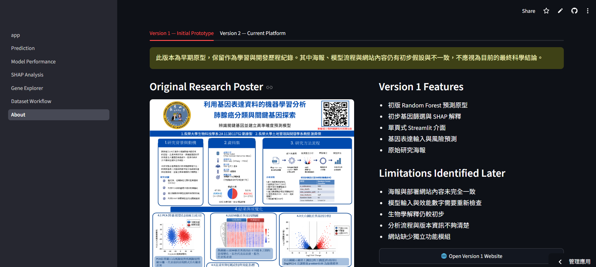

# 🫁 Lung Cancer Bioinformatics Platform

> **Machine Learning × SHAP × TCGA-LUAD × Precision Medicine**

An interactive bioinformatics platform for **Lung Adenocarcinoma (LUAD)** prediction using **Random Forest** and **10 SHAP-selected gene expression features**.

---


---

# 🌐 Live Demo

## 🚀 Streamlit

https://joyful-luad-platform.streamlit.app/

---

## 💻 GitHub Repository

https://github.com/joyful-0410/LUAD-Bioinformatics-Platform

---

# 📖 Project Overview

Lung adenocarcinoma (LUAD) is the most common subtype of non-small cell lung cancer (NSCLC).

This project develops an interactive bioinformatics platform that integrates:

- Machine Learning
- Explainable AI (SHAP)
- Gene Functional Interpretation
- Cancer Biology
- Interactive Visualization

Unlike a conventional prediction model, this platform combines prediction, biological interpretation and educational visualization into one complete web application.

---

# ✨ Platform Features

- 🤖 LUAD Risk Prediction
- 📈 Model Performance Evaluation
- 🧬 SHAP Explainable AI
- 🔬 Gene Explorer
- 📂 Dataset Workflow
- 👨‍💻 About & Development History

---

# 🖥 Platform Screenshots

---

## 🏠 Home


---

## 🤖 Prediction


---

## 📈 Model Performance


---

## 🧬 SHAP Analysis


---

## 🔬 Gene Explorer


---

## 📂 Dataset Workflow


---

## 👨‍💻 About


---

# 🧬 Selected Gene Panel

| Gene | Function |
|------|----------|
| SLC34A2 | Lung epithelial differentiation |
| MUC16 | Tumor marker (CA125) |
| ANLN | Cell division |
| CDC20 | Cell cycle regulation |
| KIF20A | Mitosis |
| TOP2A | DNA replication |
| MKI67 | Cell proliferation |
| BIRC5 | Anti-apoptosis |
| TYMS | DNA synthesis |
| CCNA2 | Cell cycle progression |

---

# 🤖 Machine Learning

### Model

Random Forest Classifier

### Feature Selection

SHAP Explainable AI

### Input

10 Gene Expression Features

### Output

LUAD Risk Prediction

---

# 📊 Dataset

Dataset

TCGA-LUAD

Samples

515

Input Features

10 Gene Expression Features

---

# 🧠 Tech Stack

- Python
- Streamlit
- Scikit-learn
- SHAP
- Pandas
- NumPy
- Plotly
- Matplotlib

---

# 📂 Project Structure

```
LUAD_Bioinformatics_Platform

├── app.py
├── pages
│   ├── Prediction
│   ├── Model Performance
│   ├── SHAP Analysis
│   ├── Gene Explorer
│   ├── Dataset Workflow
│   └── About
│
├── data
├── image
├── model.pkl
├── scaler.pkl
├── utils.py
├── requirements.txt
└── README.md
```

---

# ⚙️ Installation

Clone Repository

```bash
git clone https://github.com/joyful-0410/LUAD-Bioinformatics-Platform.git
```

Install Packages

```bash
pip install -r requirements.txt
```

Run

```bash
streamlit run app.py
```

---

# 📈 Development History

This project has evolved through multiple development stages.

Version 1 was the original undergraduate research prototype.

Version 2 was completely redesigned into a multi-page bioinformatics platform with improved machine learning visualization, explainable AI modules, and interactive biological interpretation.

> **Version 1 is preserved for learning and development history only. Some contents of the original poster and prototype website are preliminary and should not be regarded as the final scientific version.**

---

## 🔄 Platform Evolution



---

### Version 1 Prototype

Original undergraduate research website

https://github.com/joyful-0410/lung-cancer-prediction1

---

### Version 2 Current Platform

Current Streamlit Platform

https://joyful-luad-platform.streamlit.app/

---

# 🚀 Future Development

Planned future extensions include:

- Deep Learning Models
- Survival Analysis
- Drug Response Prediction
- TRBP2 Module
- RNA Binding Protein Module
- Multi-Cancer Prediction
- Clinical Decision Support

---

# 👨‍🔬 Author

**Kang-Sheng Liu (劉康聖)**

Department of Biotechnology

Chang Jung Christian University

Taiwan

Research Interests

- Cancer Bioinformatics
- Explainable AI
- Machine Learning
- Precision Medicine

---

# ⚠️ Disclaimer

This platform is intended for:

- Academic Research
- Educational Demonstration
- Bioinformatics Learning

It is **NOT** intended for clinical diagnosis or medical decision making.

---

# 🙏 Acknowledgements

- TCGA
- Streamlit
- Scikit-learn
- SHAP
- Pandas
- NumPy
- Plotly

---

⭐ If you like this project, please consider giving it a Star.
